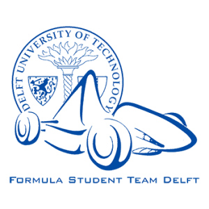

# Battery Management System (BMS)
This repository contains the code for the Battery Management System that I wrote during my time as an Embedded Software Developer at the Formula Student Team Delft.

## Toolchain
The Battery Management System is one of the Printed Circuit Boards (PCB's) of the DUT19 Formula Student car, and it has been designed, built and tested by the team during last year.
The design of the PCB can't be made available for the public, as it wasn't my responsibility.
It was centered around NXP's LPC11C12 Microcontroller and TI's BQ76930 Analog Front End, responsible for the actual battery monitoring and measuring.

The software includes FreeRTOS v10 as real-time OS for the whole car.
It was developed using MCUXpresso and tested using different methods, including SEGGER JLink software and JTrace EDU hardware, oscilloscopes and other electrical measurement tools.

## Repository structure
* **/docs** contains the whole documentation of the BMS, including the Wiki page (written by me as well) and the datasheets of the components.
* **/pictures** includes all the pictures used in this repository
* **/code**, as the name suggests, contains the BMS code developed last year from scratch. In particular, it's further divided into different folders:
* */inc* containing the header files
* */libraries* containing the support files (OS, third-party libraries)
* */src* containing the source code
